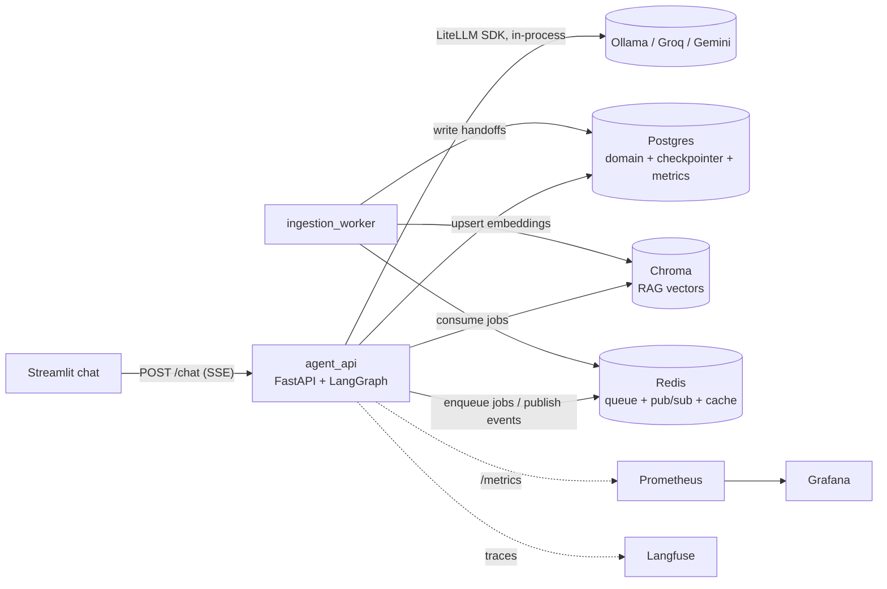

# PRD — NeoBank Support Chatbot

> Build-ready product spec for an autonomous agent to execute end to end.
> Read `CONTEXT.md` (glossary) first, then this file.
> All decisions here are locked. Where a choice is marked _optional flex_, it is off the critical path.

## 1. Purpose

A portfolio-grade **AI support chatbot** for a fictional digital bank ("NeoBank"), engineered to demonstrate — at depth and at zero monetary cost — the full skill set of four target AI-engineering roles: generative AI with LLMs, multi-agent architectures, RAG with data pipelines, complex API/microservice integration, observability + FinOps, security/compliance, and clean software engineering.

The deliverable is a public GitHub repository plus a recorded demo the candidate defends in interview.

## 2. Non-negotiable constraints

- **Zero monetary cost.** Local runtimes and free tiers only. No paid cloud, no billed API, ever.
- **No real financial actions.** "Pay invoice", "block card" are simulated state changes on mocks.
- **Provider-swappable LLM** via LiteLLM: local Ollama (Qwen3.5-9B) / Groq free / Gemini free, chosen by env.
- **Bilingual agent** (PT + EN). Repo docs, code, commits in **English**.
- **No over-engineering.** Every tool must map to a real job requirement and earn its place. No Kafka, no K8s in the core, no service split beyond the two defined.

## 3. Job-coverage matrix

Each feature exists because a target role asks for it.

| Requirement (across the 4 roles) | Where it is satisfied |
|---|---|
| Strong Python, backend software | Whole codebase, Clean Architecture + DDD |
| LLMs / generative AI | LiteLLM gateway, agent nodes |
| Multi-agent architecture (LangGraph/CrewAI) | LangGraph supervisor + specialist agents |
| Prompt engineering | Versioned system prompts, per-specialist prompts, eval runs tagged by prompt version |
| Agent memory + conversational history | Tri-tier memory (short / long / semantic) |
| RAG + knowledge base | Chroma + retrieval node over the KB |
| Data pipelines / ETL / ELT | Ingestion worker: extract → transform → chunk → embed → load |
| Complex API integration | Mock banking APIs (Postgres) + 2 real free keyless APIs: **ViaCEP** (address lookup on customer profile) + **BrasilAPI/AwesomeAPI currency quote** (used by the investments intent) |
| Microservices, Docker, distributed | 2 services + 3 datastores, Docker Compose profiles, Redis queue/events |
| Relational + NoSQL databases | Postgres (domain) + Redis (cache/queue/events) + Chroma (vector DB) — frame Redis+Chroma as the NoSQL answer |
| Observability / monitoring / performance | Langfuse (LLM tracing) + Prometheus/Grafana (ops) |
| FinOps — cost per session | LiteLLM token accounting + equivalent-cost table |
| Model evaluation / homologation | Eval set + deterministic checks + LLM-as-judge |
| Security / compliance | PII masking, prompt-injection guardrails, per-customer authz |
| CI/CD, Git | GitHub Actions: lint, type, test, eval subset, docker build |
| Clean Architecture, DDD, patterns | Layered services, DDD domain model, ADRs |
| Post-deploy sustainment / troubleshooting | Health checks, structured logs, retry/backoff, error capture |
| Multi-provider (OpenAI/Gemini/open-source) | LiteLLM: Ollama / Groq / Gemini |
| FastAPI | agent-api service |
| Human-in-the-loop | Escalation node + structured handoff to a human queue |
| Kubernetes (role 4, nominal) | `ops/k8s/` manifests **validated once in `kind`** with evidence (see §13 phase 8) — never the default run path |

**Honest coverage notes** (state these in the README, do not hide them):

- **Real cloud deploy: not covered** — consequence of the zero-cost constraint. The live Groq run (`--profile core`, no GPU) is the proxy.
- **Kafka: deliberately excluded.** No role names it; the "SQS/SNS-style queues" requirement is covered conceptually by Redis queue + pub/sub (producer, consumer, event, retry). Kafka for one producer and one consumer is over-engineering a reviewer penalizes. This rationale is the interview answer to "why no Kafka?".
- **CrewAI/Agno: not used.** One framework (LangGraph) at depth beats three shallow ones — say so explicitly.
- The full job descriptions live in `docs/jobs/` (anonymized), with a per-role bullet-by-bullet table marking each requirement `demonstrated / cited / not covered`. This matrix is only auditable against those texts.

## 4. Domain

See `CONTEXT.md` for the glossary. Product surface of the fictional bank:

- Digital checking **Account** (balance, statement).
- **Card** (credit + debit): invoice, limit, block/unblock.
- **PIX + transfers**: history, status.
- Simple **Investments** (CDB/savings): read-only.

### Intent catalog (the chatbot resolves these end to end)

| # | Intent | Reads / uses | Escalates? |
|---|---|---|---|
| 1 | Balance / statement | Account API | no |
| 2 | PIX / transfer status | Transactions API | no |
| 3 | Query / pay card invoice | Card API (pay = simulated) | no |
| 4 | Credit-limit increase | Card API + risk rule | yes, above ceiling |
| 5 | Block card (loss/theft) | Card API (simulated action) | no, but logged |
| 6 | Dispute transaction / fraud | Transactions API + risk flow | **yes, mandatory** |
| 7 | Product / fee FAQ | **RAG** over KB | no |
| 8 | Talk to human / out of scope | — | **yes** |

Cap intents at 8; more adds volume without new learning. Fraud dispute (#6) is the star demo case.

## 5. Architecture

**Two services + three datastores**; the service boundary is justified by online-serving vs batch-ingestion. (Chroma, Postgres and Redis are datastores, not services — counting stores as "microservices" invites an easy interview takedown.)

| Service | Role | Talks to |
|---|---|---|
| **agent_api** (FastAPI) | Online serving: receives chat, runs the LangGraph graph, calls LiteLLM, reads Postgres, queries Chroma, enqueues jobs to Redis. Exposes `/chat` (streaming), `/health`, `/metrics`. | Postgres, Chroma, Redis, LiteLLM |
| **ingestion_worker** | Batch/async: consumes Redis jobs. Runs the ETL ingestion pipeline. Processes escalation events (writes handoff, emits notification). | Redis, Chroma, Postgres |

### System diagram



### Request flow (one chat turn, runtime order)

1. `POST /chat` (SSE) → load session (customer id + language from Postgres, never from the message).
2. Checkpointer restores short-term memory; long-term facts recalled at session start.
3. `guardrail_in` (deterministic, pre-LLM) → router LLM call → specialist (tools hit Postgres/Chroma/real APIs, all filtered by session customer id) → `guardrail_out` (deterministic).
4. Tokens stream to the client as SSE events (`token|tool|handoff|done`); checkpointer persists the new state; `session_metrics` updated (tokens, cost, latency).

### Escalation flow (star case, crosses both services)

1. `escalation` node builds the handoff payload (§15.4) and enqueues an `escalation` job in Redis — the `/chat` response tells the customer a human will take over (SSE `handoff` event).
2. `ingestion_worker` consumes the job: persists the handoff row in Postgres (`status=queued`), publishes `escalation.created` on Redis pub/sub.
3. Subscribers react (log/notification; n8n webhook if the flex is built). The human queue is the `handoffs` table — no separate UI, by design.

### Data stores

- **Postgres** — domain: customers, accounts, transactions, cards, invoices, investments, sessions, handoffs, session_metrics.
- **Redis** — **queue** (ingestion, escalation), **pub/sub events** (`escalation.created` → notify). This is the event-driven layer; no Kafka. Cache scope is deliberately minimal: only the KB retrieval results per normalized query (TTL 1h) — chat responses are **not** cached (personalized, stateful); don't build a response cache.
- **Chroma** — embeddings for RAG.

### Orchestration

Docker Compose with profiles:

- `core`: agent_api, ingestion_worker, chroma, postgres, redis.
- `full`: core + langfuse, prometheus, grafana.

Ollama runs on the host (or its own container) for the local model. An `ops/k8s/` manifest set mirroring the compose file is an _optional flex_ validated once in a local `kind` cluster with committed evidence (§13 phase 8) — never part of the default run.

## 6. Agent design (LangGraph)

Supervisor multi-agent graph:

```
input → [guardrail_in] → [supervisor/router] → specialist → [guardrail_out] → response
                                             ↘ [escalation] → handoff
```

- **guardrail_in** — PII detection, prompt-injection heuristics, out-of-scope rejection before spending an LLM call.
- **supervisor/router** — classifies intent (1-8), extracts entities (card, transaction ref — **never customer id**), routes. The customer id comes exclusively from session context (LangGraph config), never from LLM-extracted values; every tool re-validates that the referenced resource belongs to the session's customer.
- **specialists** (each has its own focused system prompt + tools):
  - `account` — intents 1, 2
  - `card` — intents 3, 4, 5
  - `risk` — evaluates the risk rule for intents 4, 6
  - `kb` — intent 7, via RAG retrieval
  - `escalation` — intents 6, 8 and any failure: builds the handoff, writes it to the queue
- **guardrail_out** — blocks data leakage and hallucinated financial advice. Mechanism (deterministic, no extra LLM call): regex/heuristic scan of the final response for (a) PII patterns not belonging to the session customer (CPF/document/account masks), (b) a financial-advice denylist (recommendation verbs + product terms) that triggers a canned refusal, (c) secret/token patterns. Specialist prompts carry matching refusal instructions; the guardrail is the enforcement backstop, the prompt is the first line.

Multi-agent (not a single ReAct agent) is a deliberate choice: the roles ask for it, and per-specialist prompts are tighter and more testable. A single-agent fallback may be kept behind a flag.

### Memory (three tiers)

| Tier | Content | Store | When |
|---|---|---|---|
| Short | Conversation history; summarized when it exceeds **20 messages** (summarize the oldest turns with the local model, keep the last 8 verbatim) | LangGraph checkpointer (Postgres) | every session |
| Long | Cross-session customer facts (preferences, past tickets) | Postgres, keyed by customer id | recall at session start + on demand |
| Semantic (RAG) | KB (+ resolved tickets — _optional flex_, second ingestion path, only if time remains) | Chroma | retrieval for intent 7 + context augmentation |

**Demo note:** the long tier is invisible unless the seed data plants cross-session facts for the demo customer (e.g. a prior ticket referenced in the fraud flow). The seed script must include them, and the recorded demo must show the recall.

### RAG ingestion pipeline (ETL, run by the worker)

- **Extract** — load KB sources: FAQ markdown, fees/tariffs CSV, product docs (resolved tickets = _optional flex_, see memory table).
- **Transform** — clean, normalize, chunk with metadata (source, product, language PT/EN).
- **Load** — embed → upsert into Chroma. Idempotent, re-runnable; triggered on demand + on a schedule.
- **Embeddings** — `bge-m3` via sentence-transformers (strong bilingual PT/EN, local, free).

## 7. LLM providers (LiteLLM)

LiteLLM is the single gateway for all model calls, giving a unified API + native token/cost accounting. **Mode: Python SDK in-process** (inside agent_api) — not the standalone proxy server; no extra container, same accounting. The proxy would only earn its place with multiple consumer services, which this project deliberately doesn't have.

- Default local: **Ollama `qwen3.5:9b`** (confirm exact tag + quantization vs the build PC's RAM/VRAM).
- Free cloud: **Groq** (so anyone can run without a GPU) and **Gemini** free tier.
- Switch by env var; no code change. Interview framing: LiteLLM also ships Bedrock/Azure/Vertex providers — the same env switch would point at them; only billing keeps them out.
- Embedding model is separate (local bge-m3), not routed through LiteLLM.

## 8. Observability + FinOps

- **Langfuse** (self-host) — LLM-native tracing: every graph run, node, prompt, token count, latency, tool call.
- **Prometheus + Grafana** — ops metrics: throughput, p50/p95 latency, error rate, queue depth, cost per session. `agent_api` exposes `/metrics` via `prometheus_client`.
- **FinOps** — LiteLLM accounts tokens/cost per call. Star metric: **cost per session** (tokens + latency too). Local model = R$ 0, but an **equivalent-cost table** computes what the session would cost on Groq/Gemini/GPT. Persisted per session in Postgres; surfaced in a Grafana dashboard. The table cites price source + retrieval date, and token counts are taken per provider via LiteLLM (tokenizers differ across providers — never convert one provider's count to another's price without saying so).

**RAM budget (`full` profile):** self-hosted Langfuse v3 brings six containers of its own (web, worker, **ClickHouse, MinIO, plus its own Redis and Postgres**) — official sizing sums ~20 GiB on top of the core stack. Running `full` **and** the local 9B model on one PC may not fit. Plan B: run `full` with the LLM on Groq (env switch) and keep Ollama off. State the measured budget in the README quickstart.

## 9. Evaluation + prompt engineering

- **Eval set** — labeled conversations per intent (~5-10 each): expected intent, expected tool call, expected outcome. Synthetic.
- **Scoring** — deterministic checks (correct intent routed? correct tool called? escalated when required?) + **LLM-as-judge** for answer quality (helpful, correct, no hallucination). Judge default = **local Ollama model** (no rate limits); Groq only for the CI subset.
- **Prompt versioning** — system prompts as versioned files (optionally Langfuse prompt management); eval runs tagged by prompt version to compare.
- **Regression** — a cheap eval subset runs in CI; the full set runs locally. **CI model:** GitHub Actions cannot run Ollama — the CI subset uses a Groq key from Actions secrets; if rate-limited, CI degrades to deterministic checks only (never red on a 429).

## 10. Security / compliance

- **Input** — PII detection and masking in logs/traces; prompt-injection heuristics (guardrail_in); Pydantic validation on all inputs.
- **Output** — refuse financial advice; never leak another customer's data; block secrets.
- **Authz (real control)** — a session is bound to one customer id; every tool filters by that id, so the agent cannot read another customer's data. This is the headline security story. **Invariant:** the customer id flows only through session context (graph config), never through anything the LLM extracts or outputs — otherwise prompt injection could switch customers. Tools receive the id from the session, and re-validate ownership of any LLM-extracted resource reference (card, transaction) against it.
- **Secrets** — env only, `.env.example` committed, real values never in the repo.
- **Data** — all customer data is synthetic; no real PII.

## 11. Interface + delivery

- **agent_api** FastAPI: `/chat` (streaming), `/health`, `/metrics`.
- **Front** — **Streamlit** chat (built-in chat UI, trivial PT/EN toggle, R$ 0, delegable to an AI). The roles are backend/AI; do not over-invest in the front.
- **Delivery**
  - Primary (A): GitHub repo + recorded demo (GIF/video) of the fraud-dispute flow — multi-agent routing → memory recall → escalation handoff → FinOps/Grafana dashboard.
  - Optional (C): run live via Groq free tier (no GPU) — `docker compose --profile core up`.
- **README (bilingual PT/EN)** — problem statement, architecture diagram, quickstart, provider switch, demo video, screenshots.
- **`docs/ai-assisted-development.md`** — how AI was used (design via grilling, code/test generation, code review), citing the wayfinder map + this PRD as evidence; CI carries an optional AI code-review step.

## 12. Repo structure + tooling

```
neobank-support/
├── services/
│   ├── agent_api/         # domain / application / infrastructure / interface
│   └── ingestion_worker/  # same layers
├── shared/                # domain model, LiteLLM config, schemas, observability utils
│                          #   deliberate monorepo shared lib: both services version together and
│                          #   deploy together; the coupling is accepted and documented (interview
│                          #   answer: "shared kernel" — split it only if services ever version apart)
├── data/                  # synthetic seeds: customers, transactions, KB sources
├── eval/                  # eval sets, judge, runner
├── ops/                   # docker-compose, prometheus, grafana, k8s (optional)
├── frontend/              # Streamlit chat
├── prompts/               # versioned system prompts (one file per node, front-matter version)
├── docs/                  # PRD, ADRs, ai-assisted-development.md, architecture.md
│   ├── jobs/              # the 4 anonymized job descriptions + bullet-by-bullet coverage table
│   └── specs/             # build specs from §15 (schemas, contracts, prompts, eval format)
├── tests/
├── .github/workflows/     # CI
├── CONTEXT.md
└── README.md
```

- Per-service Clean Architecture: **domain** (entities, value objects, rules) → **application** (use cases) → **infrastructure** (Postgres/Redis/Chroma/LiteLLM adapters) → **interface** (FastAPI routes / worker handlers).
- **Where LangGraph lives:** the graph and its nodes are **application layer** — nodes orchestrate use cases; agent tools are application-layer interfaces implemented by infrastructure adapters. The domain layer imports neither `langgraph` nor `litellm`.
- DDD domain model: Account, Card, Transaction, Invoice, Limit, Risk rule, Handoff.
- Python 3.12+, **uv**, ruff, mypy, pytest, pre-commit, Docker.

## 13. Build phases (implementation roadmap)

Execute in order; each phase ends green (tsc-equivalent = mypy clean, pytest green).

1. **Foundation** — repo skeleton, uv, Docker Compose `core`, Postgres + Redis + Chroma up, LiteLLM gateway wired, `/health`.
2. **Domain + data** — DDD domain model, synthetic seeds, mock banking APIs (Postgres-backed), KB source files.
3. **RAG pipeline** — ingestion worker ETL, bge-m3 embeddings, Chroma upsert, retrieval query.
4. **Agent core** — LangGraph supervisor + specialists + tools, tri-tier memory, guardrail nodes.
5. **Ops** — Langfuse tracing, Prometheus/Grafana, FinOps cost-per-session.
6. **Eval + security** — eval set, LLM-judge, prompt versioning, guardrail hardening, per-customer authz.
7. **Interface + delivery** — `/chat` streaming, Streamlit front, bilingual README, recorded demo, CI/CD, AI-as-ally doc.
8. **Optional flexes** — (a) **k8s validated in `kind`**: write `ops/k8s/` manifests mirroring compose `core`, apply them once in a local `kind` cluster, capture evidence (`kubectl get pods` all Ready + one `/chat` round-trip), commit the evidence to `docs/`; an unapplied manifest is worse than none. (b) Live Groq run. (c) **n8n automation — first flex to pick up**: vaga 3 names n8n nominally; one small flow (e.g. `escalation.created` webhook → notification) is enough to move it from cited to demonstrated. MLflow dropped — Langfuse prompt management + eval tags already cover experiment comparison.

## 14. Acceptance criteria

- `docker compose --profile core up` brings the chatbot up; a customer can run all 8 intents.
- Fraud-dispute (#6) routes through supervisor → risk → escalation and produces a structured handoff.
- Per-customer authz proven: a session cannot read another customer's data (test).
- Cost-per-session metric visible in Grafana; Langfuse shows a full trace.
- Eval set runs; deterministic + judge scores reported; a subset runs in CI.
- mypy clean, ruff clean, pytest green. README + demo published.
- Provider switch (Ollama ↔ Groq ↔ Gemini) works by env var.
- The two real free APIs (ViaCEP, currency quote) are called live in at least one intent flow.
- Guardrail proven: a prompt-injection attempt to read another customer's data is blocked (test).

## 15. Build specs (phase 0.5 — write these before coding)

One more level of detail on decisions already made. Each item becomes a file under `docs/specs/` during phase 1; an executing agent must not invent any of these.

1. **Postgres schema** — DDL per table: `customers` (id, name, document, address_cep, language), `accounts` (id, customer_id, balance), `transactions` (id, account_id, type PIX/transfer/card/fee, amount, status pending/settled/failed, risk_flag, created_at), `cards` (id, account_id, kind credit/debit, state active/blocked, limit_amount), `invoices` (id, card_id, month, total, status open/paid), `investments` (id, customer_id, product CDB/savings, principal), `sessions` (id, customer_id, language, started_at), `handoffs` (id, session_id, payload jsonb, status queued/claimed), `session_metrics` (session_id, tokens_in, tokens_out, cost_brl_equiv, latency_p95_ms), `customer_facts` (customer_id, fact, source_session_id, created_at). Adjust columns during phase 2, but every table ships a migration.
2. **Mock banking API contracts** — internal REST endpoints as a **FastAPI sub-app mounted at `/mock` inside agent_api** (real HTTP boundary so retry/timeout is exercised, no extra service): request/response Pydantic models per intent tool, plus **deliberate failure modes** — a `FAULT_RATE` env injects timeouts and 500s so retry/backoff is exercised, not dead code. Errors follow one envelope: `{error: {code, message, retryable}}`.
3. **`/chat` contract** — `POST /chat` `{session_id, message}` → **SSE stream** of `{type: token|tool|handoff|done, data}`; errors as the same envelope; session created via `POST /sessions {customer_id, language?}`.
4. **Handoff payload schema** — `{session_id, customer_id, intent, conversation_summary, entities: {transaction_ref?, card_id?}, risk_outcome, suggested_resolution, created_at}`. This is the star-demo climax; the recorded demo shows this JSON.
5. **Risk rule (deterministic, literal)** — limit increase: auto-approve ≤ 1.5× current limit if no `risk_flag` transaction in 90 days, else escalate. Fraud dispute: always escalate; risk node attaches `risk_outcome` (flagged transaction count, dispute amount vs balance ratio).
6. **Eval-set item format** — JSONL: `{id, language: pt|en, input, expected_intent, expected_tool, expected_escalation: bool, expected_outcome_contains: []}`. 5–10 per intent, both languages represented.
7. **Prompt specs** — one markdown file per node under `prompts/` (`router.md`, `account.md`, `card.md`, `risk.md`, `kb.md`, `escalation.md`, `judge.md`), front-matter `version:`; eval runs record the version. Skeleton per file: role, scope, tools available, refusal rules, **few-shot examples** (vaga 3 names few-shot; include at least in `router.md` and `judge.md`), output format.
8. **Language handling** — session carries `language`; if absent, guardrail_in detects from the first message (cheap heuristic/lib, no LLM call) and pins it for the session; specialist prompts receive it as a variable.
9. **KB content list** — synthetic sources committed under `data/kb/`: `faq_accounts.md`, `faq_cards.md`, `fees.csv`, `products_investments.md` — each authored in PT and EN.
10. **Redis job/event format** — queue jobs `{job_id, kind: ingestion|escalation, payload, attempts}`; pub/sub event `escalation.created {handoff_id}`. Retry with exponential backoff, max 3 attempts, then dead-letter list + error log.

## 16. Out of scope

- Desktop-native front (vercel-labs/native), paid LLM tiers, paid/real cloud deploy, self-hosted GPU.
- Real financial actions.
- Kafka, K8s-at-scale, multi-cloud, service mesh, Azure AI Search, Databricks.
- Public live host of the local 9B model (the Groq path covers live use).
- Study-curriculum and interview Q&A kit (optional side-efforts after the agent stands).
